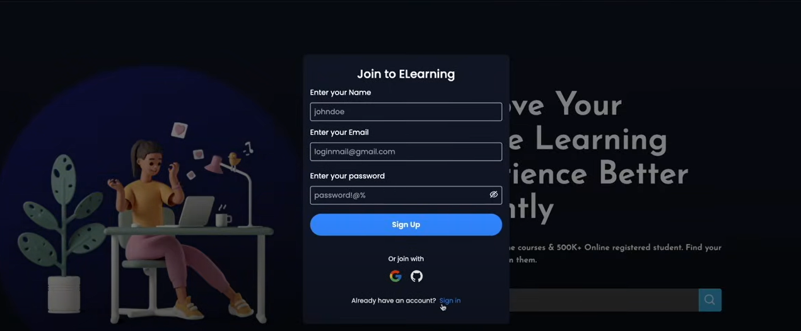
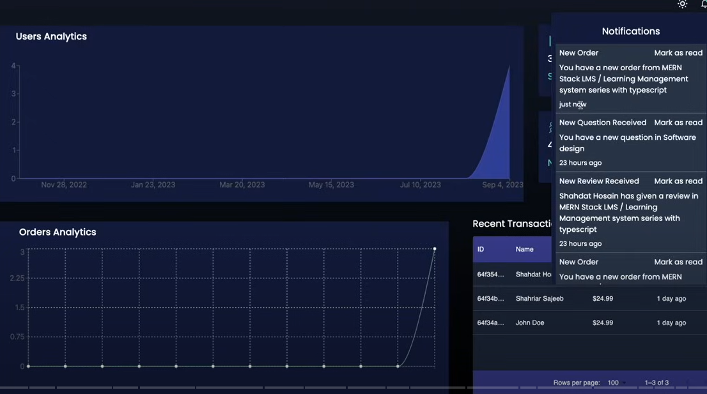

# Project Readme

> [Follow or Connect me](https://www.linkedin.com/in/jagan-kumar-hotta-502a76270/)

# Introduction
Welcome to our next project! This readme file will guide you through the key aspects of the project, including its purpose, functionalities, and configurations.



- Unique feature : Presence of dashboard with RealTime Analytics.


# Project Overview

Our next project aims to develop a comprehensive Learning Management System (LMS) for a supervised learning platform targeting both elderly individuals and college students. The platform will incorporate advanced networking capabilities and a wide range of LMS algorithms to create an inclusive and effective learning environment.

# Functionalities
 - User Roles : The platform will support multiple user roles, including students, instructors, and administrators, each with varying access levels and functionalities.
 - Course Management : Instructors will be able to create and manage courses, while students can enroll in and access these courses.
 - Networking Features : The platform will facilitate networking and interaction among users, fostering a collaborative learning experience.
 - LMS Algorithms : The system will integrate various LMS algorithms to personalize the learning experience and optimize educational outcomes.

# Project Setup and Configurations
To get started with the project, please ensure that you have the necessary development environment set up. Follow the steps below to configure your development environment:

- Clone the Repository: Begin by cloning the project repository to your local machine using the following command:
  
```git clone <repository-url> ```

- Install Dependencies: Navigate to the project directory and install the required dependencies by running the following command:
  
```npm install```

- Environment Variables: Create a .env file in the project root directory and define the necessary environment variables, including database credentials, API keys, and any other sensitive information.

- Database Setup: Configure the database connection by updating the database credentials in the project's configuration files. Use scripts or migrations to set up the initial database schema and seed data if applicable.

- Launch the Application: Once the setup is complete, launch the application using the appropriate command. For example, if the project uses Node.js, you can start the application with:
  
```npm start```

- Upload Images: To upload images, integrate a suitable image upload functionality within the application. Ensure that the uploaded images are stored securely and efficiently, and the relevant paths or URLs are correctly managed.


With the project environment configured, the next steps involve implementing the specific functionalities outlined in the project requirements. Work on developing the user roles, course management system, networking features, and integrating LMS algorithms to create a robust and user-friendly learning platform.

We look forward to collaborating on this exciting project and creating a valuable learning experience for our users.

# Happy coding! The Project Team
